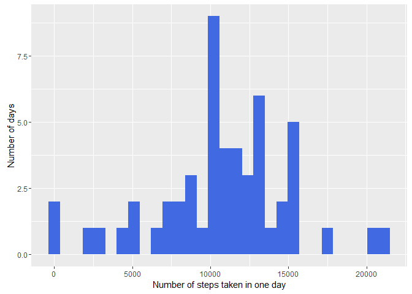
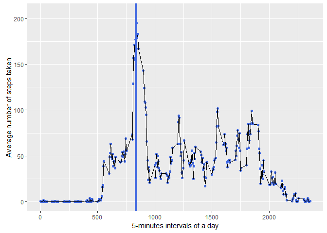
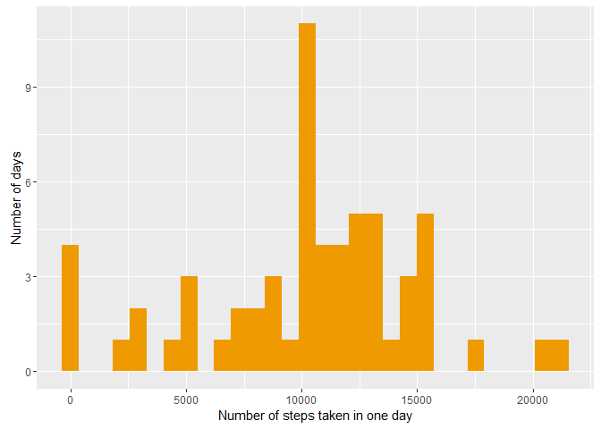
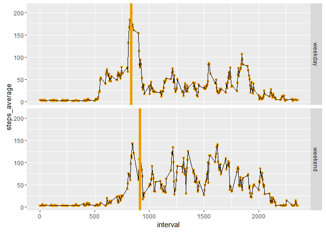

# Reproducible Research: Peer Assessment 1
Alexis Van Espen  
20 juillet 2016  


## Loading and preprocessing the data

Before loading the data, we will load the required packages.


```r
library(ggplot2)
library(dplyr)
library(reshape2)
```

We now proceed to load and preprocess the data.


```r
d.original <- read.csv("activity/activity.csv")
d.activity <- d.original[!is.na(d.original$steps), ]
d.activity$date <- as.Date(d.activity$date, "%Y-%m-%d")
```

We obtain **15264** rows (rows containing NA in *steps* have been removed, per the instructions: *"For this part of the assignment, you can ignore the missing values in the dataset."*).


## What is the mean total number of steps taken per day?

**1. Calculate the total number of steps taken per day**

The answer to this question is a dataframe (*d.steps*), with one row per day.


```r
d.steps <- with(d.activity, tapply(steps, date, sum, na.rm = TRUE))
d.steps <- data.frame(steps_total = d.steps, date = row.names(d.steps))
d.steps <- d.steps[!is.na(d.steps$steps_total), ]
```

**2. Make a histogram of the total number of steps taken each day**

A histogram graphs *one* numeric variable on the x-axis, while the y-axis displays its frequency or density. More info on [Wikipedia](https://en.wikipedia.org/wiki/Histogram).


```r
g.steps <- ggplot(d.steps, aes(x = steps_total)) + geom_histogram(fill = vc.colour1)
g.steps <- g.steps + xlab("Number of steps taken in one day")
g.steps <- g.steps + ylab("Number of days")

print(g.steps)
```

<!-- -->

**3. Calculate and report the mean and median of the total number of steps taken per day**


```r
vn.steps.mean <- with(d.steps, mean(steps_total, na.rm = TRUE))
vn.steps.mean <- as.integer(vn.steps.mean)

vn.steps.median <- with(d.steps, median(steps_total, na.rm = TRUE))
vn.steps.median <- as.integer(vn.steps.median)
```

The mean number of steps taken per day is **10766** while the median is **10765**.  

## What is the average daily activity pattern?

**1. Make a time series plot (i.e. type = "l") of the 5-minute interval (x-axis) and the average number of steps taken, averaged across all days (y-axis)**

We first create a dataset with one row per 5-minute interval.


```r
d.interval <- with(d.activity, tapply(steps, interval, mean, na.rm = TRUE))
d.interval <- data.frame(steps_average = d.interval, interval = row.names(d.interval))
d.interval <- d.interval[!is.na(d.interval$steps_average), ]
```

We will plot the dataframe soon, but before we proceed, let us anticipate on the next question: which interval shows the highest average number of steps?


```r
d.interval <- d.interval %>% mutate(interval = as.character(interval)) %>% mutate(interval = as.integer(interval)) %>% 
    mutate(steps_average = as.integer(steps_average)) %>% arrange(desc(steps_average))

vi.intervalmax <- d.interval[1, 2]
```

Let's plot the dataframe to answer the previous question.


```r
vn.xrange <- range(d.interval$interval)

g.interval <- ggplot(d.interval, aes(x = interval, y = steps_average))
g.interval <- g.interval + geom_point(color = vc.colour1) + geom_line(group = 1)
g.interval <- g.interval + coord_cartesian(xlim = vn.xrange)
g.interval <- g.interval + xlab("5-minutes intervals of a day")
g.interval <- g.interval + ylab("Average number of steps taken")
g.interval <- g.interval + geom_vline(xintercept = vi.intervalmax, color = vc.colour1, 
    size = 2)

print(g.interval)
```

<!-- -->


**2. Which 5-minute interval, on average across all the days in the dataset, contains the maximum number of steps?**

On average, the interval during which the individual made the maximum number of steps was the **835**-interval, during which **206** steps were taken.

## Imputing missing values

**1. Calculate and report the total number of missing values in the dataset (i.e. the total number of rows with NAs)**


```r
vi.missing <- length(which(is.na(d.original$steps)))
```

The original dataset contains **2304** NA values in *steps*.

**2. Devise a strategy for filling in all of the missing values in the dataset. The strategy does not need to be sophisticated. For example, you could use the mean/median for that day, or the mean for that 5-minute interval, etc.**

We will replace the NA values of a given day by the mean of that day. We always keep the original dataset untouched; the modified dataset is *d.processed*.

In the next step, our code proceeds as follows.

0. Choose a summary statistic, e.g. the mean or the median. I chose the mean.
1. Compute the summary statistic for each day.
2. Replace every missing value by the summary statistic of the corresponding day.

The new dataframe is *d.processed*.

**3. Create a new dataset that is equal to the original dataset but with the missing data filled in.**


```r
# Which function do we use to aggregate the data?  This can be changed later
# without affecting the rest of the code.
vn.aggregate <- mean
vc.aggregate.name <- "daily_mean"

# Create a summary dataframe with one row per day.
d.summary <- with(d.original, tapply(steps, date, vn.aggregate, na.rm = TRUE))
d.summary <- data.frame(d.summary, row.names(d.summary))
d.summary <- d.summary[!is.nan(d.summary[[1]]), ]
names(d.summary) <- c(vc.aggregate.name, "date")

# Split the dataframe in two parts: steps is NA or not NA.
d.noNA <- d.original[!is.na(d.original$steps), ]
d.NA <- d.original[is.na(d.original$steps), ]

# Replace the NA values by the daily aggregates.
d.NA$steps <- sapply(d.NA$date, function(x) d.summary[x, vc.aggregate.name])

# Merge the two datasets.
d.processed <- rbind(d.noNA, d.NA)
d.processed <- arrange(d.processed, date, interval)
```

**4. Make a histogram of the total number of steps taken each day and Calculate and report the mean and median total number of steps taken per day. Do these values differ from the estimates from the first part of the assignment? What is the impact of imputing missing data on the estimates of the total daily number of steps?**

First, we'll create a dataset mapping each day to the total number of steps taken this day. This is the same strategy we used above, before having processed the original data.


```r
d.steps2 <- with(d.processed, tapply(steps, date, sum, na.rm = TRUE))
d.steps2 <- data.frame(steps_total = d.steps2, date = row.names(d.steps2))
```

Now we proceed to display the histogram of *steps_total*.


```r
g.steps2 <- ggplot(d.steps2, aes(steps_total)) + geom_histogram(fill = vc.colour2)
g.steps2 <- g.steps2 + xlab("Number of steps taken in one day")
g.steps2 <- g.steps2 + ylab("Number of days")

print(g.steps2)
```

<!-- -->

What are the mean and median total number of steps taken per day?


```r
vn.steps.mean2 <- with(d.steps2, mean(steps_total, na.rm = TRUE))
vn.steps.mean2 <- as.integer(vn.steps.mean2)

vn.steps.median2 <- with(d.steps2, median(steps_total, na.rm = TRUE))
vn.steps.median2 <- as.integer(vn.steps.median2)
```

The mean number of steps taken per day is **10276** while the median is **10571**.  

The next table compares the mean and median on two datasets. By *Original*, we denote the original dataset with NA values removed. By *Processed*, we denote the original dataset with NA values replaced by a summary statistic (see above).

| Statistic | Original            | Processed            |
|-----------|---------------------|----------------------|
| Mean      | 10766   | 10276   |
| Median    | 10765 | 10571 |

Obviously, the statistics in the processed dataset have been pushed down.

## Are there differences in activity patterns between weekdays and weekends?

**1. Create a new factor variable in the dataset with two levels – “weekday” and “weekend” indicating whether a given date is a weekday or weekend day.**


```r
d.processed2 <- d.processed %>% mutate(date = as.Date(date, "%Y-%m-%d")) %>% 
    mutate(day = weekdays(date)) %>% mutate(weekpart = sapply(day, function(x) if (x == 
    "samedi" || x == "dimanche") "weekend" else "weekday")) %>% mutate(weekpart = factor(weekpart))
```

**2. Make a panel plot containing a time series plot (i.e. type = "l") of the 5-minute interval (x-axis) and the average number of steps taken, averaged across all weekday days or weekend days (y-axis). See the README file in the GitHub repository to see an example of what this plot should look like using simulated data.**

We must first create a dataset with one row per (interval, weekpart).


```r
mn.interval2 <- with(d.processed2, tapply(steps, list(interval, weekpart), mean, 
    na.rm = TRUE))

# For each part of the week, we extract the intervals corresponding to the
# maximum average steps.  This will help us plot a vertical line in each
# facet of the upcoming graph.

vn.stepsmax <- apply(mn.interval2, 2, max, na.rm = TRUE)
vi.intervalmax2 <- numeric(2)
vi.intervalmax2[1] <- rownames(mn.interval2)[which(mn.interval2[, "weekday"] == 
    vn.stepsmax["weekday"])]
vi.intervalmax2[2] <- rownames(mn.interval2)[which(mn.interval2[, "weekend"] == 
    vn.stepsmax["weekend"])]
vi.intervalmax2 <- as.integer(as.character(vi.intervalmax2))

# Now we convert the matrix to a dataframe with one row per (interval,
# weekpart).

d.interval2 <- as.data.frame(mn.interval2)
d.interval2$interval <- row.names(d.interval2)
d.interval2 <- melt(d.interval2, measure.vars = 1:2, variable.name = "weekpart", 
    value.name = "steps_average")
d.interval2$interval <- as.integer(as.character(d.interval2$interval))
```

Before plotting the data, we create a separate dataframe for the vertical lines howing the interval with the maximum average number of steps.


```r
d.vlines <- data.frame(weekpart = unique(d.interval2$weekpart), maxinterval = vi.intervalmax2, 
    maxsteps = as.integer(vn.stepsmax))
row.names(d.vlines) <- d.vlines$weekpart
```


With this dataset, we can proceed to graph the required panel. Vertical lines have been drawn at the interval of maximum average number of steps. 

* As for weekdays, this is the interval **835**, during which **210** steps were taken.
* As for weekends, this is the interval **915**, during which **156** steps were taken.

To wrap up, this individual tends to walk slightly less and later during the week-end.


```r
vn.xrange <- range(d.interval2$interval)

g.interval2 <- ggplot(d.interval2, aes(x = interval, y = steps_average))
g.interval2 <- g.interval2 + geom_point(color = vc.colour2) + geom_line(group = 1)
g.interval2 <- g.interval2 + coord_cartesian(xlim = vn.xrange)
g.interval2 <- g.interval2 + geom_vline(data = d.vlines, aes(xintercept = maxinterval), 
    color = vc.colour2, size = 2)
g.interval2 <- g.interval2 + facet_grid(weekpart ~ .)

print(g.interval2)
```

<!-- -->
